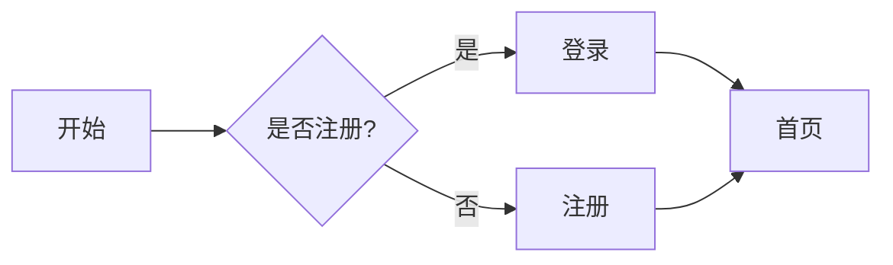




这是一篇"展示型"文章，会尽可能地把本站支持的 **Markdown 语法**、**宏组件**、**图片画廊**、**按钮** 等都演示一遍，方便你写自己的内容时直接参考 (´▽`)

## 1. 标题层级

# H1 标题
## H2 标题
### H3 标题
#### H4 标题
##### H5 标题

## 2. 文字强调

普通文本，**加粗**，*斜体*，***加粗 + 斜体***，~~删除线~~，`行内代码`。

> 这是一段引用文字，用于强调、备注或引用他人的话。
>
> 引用可以多行。

## 3. 列表

### 无序列表

- 一年级
- 二年级
- 三年级
  - 三年级一班
  - 三年级二班

### 有序列表

1. 第一步
2. 第二步
3. 第三步

### 任务列表

- [x] 已完成
- [ ] 待办事项 1
- [ ] 待办事项 2

## 4. 链接

- 内联链接：[返回首页]({{ "/" | url }})
- 带标题的链接：[Wiki 首页]({{ "/wiki/" | url }} "Wiki 文档")
- 自动链接：<https://github.com>

## 5. 图片 & 图片画廊

单张图片演示：


> 上面的 `image` 短代码会被处理为响应式 `<picture>`，自动生成 WebP + JPEG 多分辨率。
> 但普通 Markdown 图片不会被处理，仅作示意。

下面是 **image 画廊**（用项目内置的 shortcode）：

<div class="image-gallery">
    
    
    
</div>

## 6. 代码块

### JavaScript

```javascript
// 求斐波那契数列第 n 项
function fib(n) {
    if (n <= 1) return n;
    return fib(n - 1) + fib(n - 2);
}

console.log(fib(10)); // 55
```

### Python

```python
def greet(name: str) -> str:
    return f"Hello, {name}!"

print(greet("World"))
```

### HTML

```html
<!DOCTYPE html>
<html lang="zh-CN">
<head>
    <meta charset="UTF-8">
    <title>示例</title>
</head>
<body>
    <h1>Hello</h1>
</body>
</html>
```

### Shell / PowerShell

```powershell
npm install
npm run dev
```

## 7. 表格

| 字段       | 类型    | 必填 | 说明             |
| ---------- | ------- | ---- | ---------------- |
| `title`    | string  | 是   | 文章标题         |
| `author`   | string  | 否   | 作者姓名         |
| `date`     | date    | 否   | 发布日期         |
| `tags`     | array   | 否   | 标签数组         |
| `layout`   | string  | 否   | 布局模板路径     |

## 8. 分隔线

---

## 9. 折叠 / 详情

<details>
<summary>点击展开：什么是 Eleventy？</summary>

Eleventy（简称 11ty）是一个简洁强大的静态站点生成器，基于 Node.js。
本仓库就是用 Eleventy 构建的。

- 官网：<https://www.11ty.dev>
- 优点：配置简单、速度快、支持多种模板语言
</details>

## 10. 脚注

这是一段包含脚注的文字[^1]，还有另一个脚注[^note]。

[^1]: 这是第一个脚注的内容。
[^note]: 这是带自定义名字的脚注。

## 11. 转义字符

如果要显示 Markdown 的特殊字符，可以使用反斜杠转义：\* 不是斜体 \*，\# 不是标题。

---

## 12. 宏组件演示

### 12.1 按钮（button.njk）

普通按钮：

{{ button("fa-solid fa-play", "立即开始", "/") }}
{{ button("fa-solid fa-book", "阅读 Wiki", "/wiki/") }}
{{ button("fa-solid fa-code", "查看源码", "https://github.com") }}

### 12.2 卡片（card.njk）

#### 12.2.1 `cardFull` 通栏独立卡片

{{ cardFull(
    "6月班级量化分",
    "本次量化分由纪律、学习、卫生三项组成，详情见正文。",
    "/event/scoreclass6/",
    "查看详细信息"
) }}

{{ cardFull(
    "Wiki 文档",
    "新手指南、编码规范、写作规范一应俱全。",
    "/wiki/",
    "浏览 Wiki"
) }}

#### 12.2.2 `card` 网格卡片

{{ card("事件", "查看所有事件", "/event/") }}
{{ card("文章", "查看所有文章", "/article/") }}
{{ card("Wiki", "知识库与教程", "/wiki/") }}

上面是没有套div，所以不是三列展示

<div class="cardzone-three-columns">
{{ card("学习资源", "一些常用的学习资源", "/zone.html#study", " 跳转") }}
{{ card("事件", "班级里的一些事件", "/event.html", "进入") }}
{{ card("讨论区", "[需要 Github 账户]可以在这里讨论一些事情", "/discussion.html", "前往") }}
</div>

套了div后

#### 12.2.3 `cardStandalone` 独立信息卡片

{{ cardStandalone("fa-solid fa-circle-info", "提示", "这是一条提示信息卡片。") }}

{{ cardStandalone("fa-solid fa-triangle-exclamation", "警告", "这是一条警告信息卡片。", bgColor="#fffbe6", textColor="#5a4a00") }}

{{ cardStandalone("fa-solid fa-circle-check", "成功", "这是一条成功信息卡片。", bgColor="#e7f8ee", textColor="#1a6e3a") }}

## 13. 数学公式（如启用 KaTeX）

行内公式：爱因斯坦的质能方程 $E = mc^2$。

块级公式：

$$
\int_{-\infty}^{\infty} e^{-x^2} \, dx = \sqrt{\pi}
$$

## 14. Mermaid 流程图（如启用）



## 15. 结束语

以上就是本站几乎所有的可展示元素，希望对你有帮助～ (•̀ᴗ•)و

如需补充其它语法或宏，编辑本文件即可。